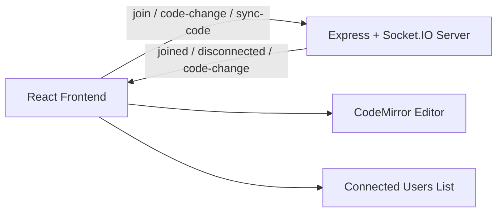

# CodeSync

Real-time collaborative code editing for teams, students, and interviewers built with React and Socket.IO.

## 📌 About the Project

CodeSync is a browser-based collaborative coding platform that lets multiple users join the same room and edit code together in real time. The project solves the need for instant shared coding sessions without requiring a local IDE setup or complex infrastructure. It is useful for pair programming, remote collaboration, interview coding rounds, and quick teamwork on small code snippets.

The application currently uses in-memory room and client tracking on the server. There is no database or user authentication layer implemented in the repository.

## ✨ Features

- Create a new room with a generated unique room ID
- Join an existing room using a shared invite code
- Real-time code synchronization across connected users
- Collaborative editing with CodeMirror
- Live participant list showing connected users
- Copy room ID to clipboard from the editor screen
- Leave room flow with toast notifications
- Username-based presence tracking
- Browser-based interface with React Router navigation

## 🛠️ Tech Stack

### Frontend
- React
- React Router
- CodeMirror

### Backend
- Node.js
- Express
- Socket.IO


## 🏗️ Project Architecture

CodeSync follows a lightweight client-server architecture:

- The frontend is a React app that renders the home screen and editor workspace.
- Users create or join rooms through the UI.
- The backend is an Express server with Socket.IO.
- When a user joins a room, the server tracks the socket and username.
- Code edits are broadcast to all other connected clients in the same room.
- A sync event also sends the latest code to a newly joined participant.




## 📂 Project Structure
```text
CodeSync/
├── .env.sample
├── .gitignore
├── package.json
├── package-lock.json
├── server.js
├── public/
│   └── code-sync.png
├── README.md
└── src/
    ├── Action.js
    ├── App.css
    ├── App.js
    ├── App.test.js
    ├── index.css
    ├── index.js
    ├── logo.svg
    ├── reportWebVitals.js
    ├── setupTests.js
    ├── socket.js
    ├── components/
    │   ├── Client.js
    │   └── Editor.js
    └── pages/
        ├── EditorPage.js
        └── Home.js
```

## ⚙️ Installation & Setup
```bash
git clone https://github.com/Ms-Solanki-07/CodeSync
cd CodeSync
npm install
```
Create a .env file in the project root by copying .env.sample, then configure the required values.

## ▶️ Running the Project
Start the backend in one terminal:
```bash
npm run server:dev
```

Start the frontend in a second terminal:
```bash
npm run start
```

## 🧠 Technical Highlights

- Real-time synchronization using Socket.IO event broadcasting
- Room-based collaboration using unique UUID-generated room IDs
- CodeMirror-powered editor with bracket and tag auto-completion
- In-memory user tracking via a socket-to-username map
- Reactive connected-client list with user avatars
- Client-side routing for room-based workflows
- Clipboard support for copying room join codes


## 📈 Future Improvements

The following improvements are realistic next steps for the project, but are not currently implemented:

- Persistent room state and saved code history
- User authentication and profile management
- Support for multiple files or project tabs
- Language selection beyond JavaScript
- Cursor position and text selection sharing
- Chat or comment system inside collaboration rooms
- Deployment configuration for production environments
- Room expiration or cleanup logic for inactive sessions